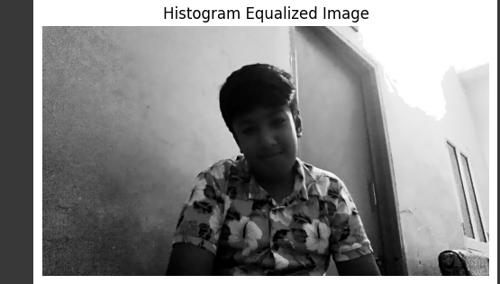
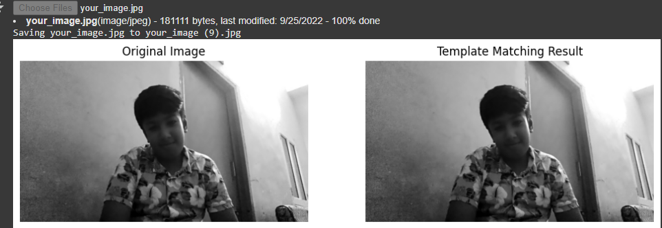

# Image Processing Algorithms Project

This project demonstrates several image processing techniques implemented in Python using OpenCV. The algorithms implemented include **Histogram Equalization**, **Gradient Edge Detection**, **Image Sharpening**, and **Template Matching**. The project was developed using Google Colab and is intended to enhance image quality and feature extraction.

## Algorithms Implemented:
- **Histogram Equalization**: Enhances the contrast of an image by adjusting the intensity distribution.
- **Gradient Edge Detection**: Identifies edges in the image using gradient-based methods.
- **Image Sharpening**: Enhances image details and removes blurriness.
- **Template Matching**: Finds a template image within a larger image.

## Screenshots:
Here are some visualizations of the results from the implemented algorithms:

### 1. **Histogram Equalization**:
The following image shows the result of applying **Histogram Equalization** to an image, which enhances the contrast:



### 2. **Template Matching**:
This image shows the result of applying **Template Matching** where the template was successfully identified within the larger image:



## Installation:
To run the code locally, you'll need to have **Python 3.x** installed along with the following libraries:
- OpenCV
- NumPy
- Matplotlib
- PIL (Pillow)

You can install these dependencies by running:
```bash
pip install opencv-python numpy matplotlib pillow
